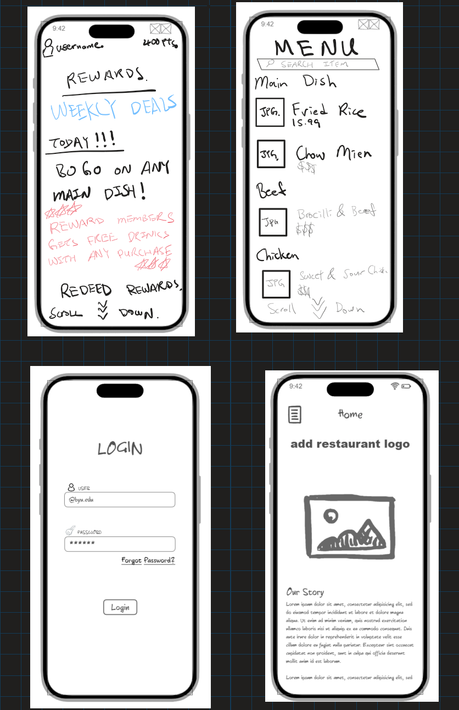

# Brothers HotPot

## Elevator Pitch

Are you craving Chinese food? We've got the place for you, Brothers' hotPot is the newly established local authentic Chinese buffet. This website will not only allow users to browse the delicious menu items, but assist them in joining the rewards program to receive deals and save money on their dining experience. The easy to navigate web design helps users find the restaurant, review the restaurant, and satisfy their Chinese food craving. 

## Design :pencil2:
- 
## Key Features

- Display menu with embedded photos and price
- Interactive map with directions to HotPot
- 360 interactive panorama of HotPot
- Secure login over HTTPS
- Embeded Google reviews
- Interactive photo/video gallery
- Ability for admin to edit food items, prices & pictures
- Rewards program that stores users' reward points

## Technologies

I am going to use the required technologies in the following ways.

- **HTML** - Uses correct HTML structure. Four to Five HTML pages. One for gallery & our story, one for login, one for reward program, one for hiring page, one for menu. Lunks to pages and artifacts.
- **CSS** - Traditional chinese cultural styling for images and videos. Good for all devices. Simple and traditional layout.
- **JavaScript** - Will be implemented in the map system. Used for login.
- **React** - Will also be implemented in the map system.
- **Web Service** - We will use google services for maps and costumer reviews.
- **Authentication** - Authentication for login.
- **Database data** - Stores login info, menu items and prices
- **WebSocket data** - Data depicting the amount of times eadch menu item is viewed. As each user leaves a review, other users will see it.